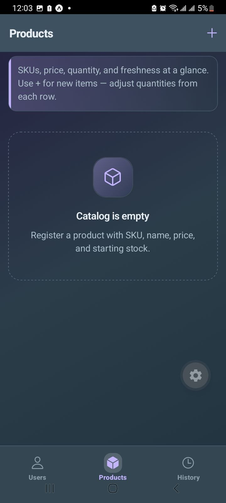
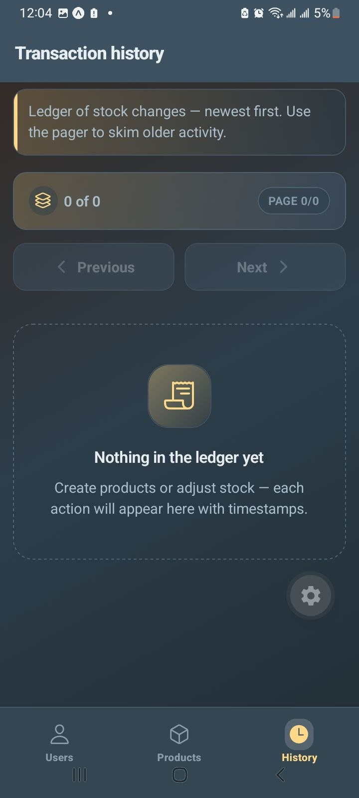
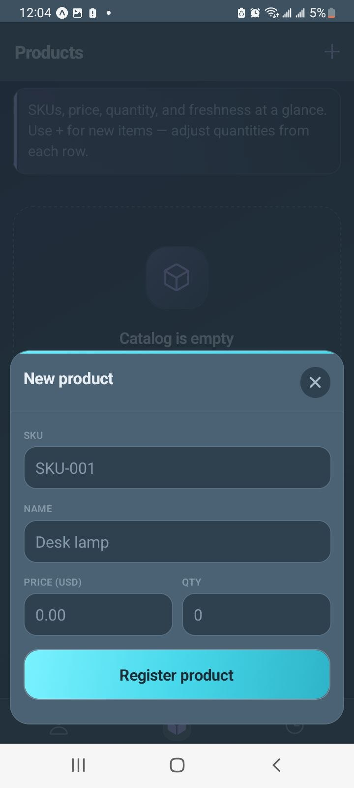

# Inventory manager (Expo + NativeWind)

Small React Native demo that simulates **user registration**, **product catalog**, **stock changes**, and a **paginated transaction history** using only in-memory state (no backend).

**Repository:** [https://github.com/lensbelete/inventory-manager](https://github.com/lensbelete/inventory-manager)

## Screenshots

<p align="center">
  
  
  
  
  
</p>

## Setup

Requirements: Node.js (LTS recommended) and npm.

```bash
npm install
npm start
```

Then press `i` for iOS simulator, `a` for Android emulator, or scan the QR code with Expo Go.

## What’s included

- **Navigation** — bottom **tabs** for Users, Products, and History; **modals** for registering users/products and adjusting stock.
- **Users** — register email and full name (listed after signup).
- **Products** — register SKU, name, price, and initial quantity (SKU must be unique; validation on all fields).
- **Stock** — add or remove quantity per product; removals are blocked if stock would go negative.
- **Status** — each product shows SKU, quantity, and last updated time.
- **History** — chronological list of changes with simple previous/next pagination.

Mutations use a short artificial delay to mimic async API calls while staying entirely on-device.

## Scripts

| Command           | Description           |
| ----------------- | --------------------- |
| `npm start`       | Start Expo dev server |
| `npm run ios`     | Open iOS simulator    |
| `npm run android` | Open Android emulator |
| `npm run web`     | Run in web browser    |
| `npm run lint`    | Run ESLint            |
